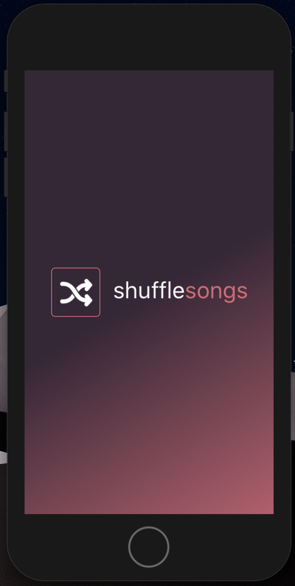
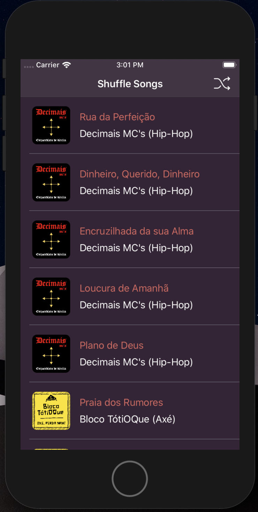
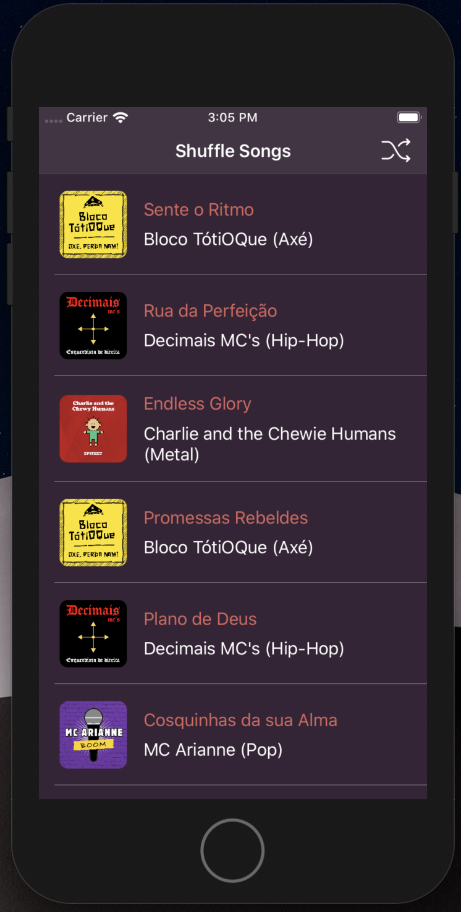

# Shuffle Songs iOS App
Code challenge 

## Descrição

Você decidiu lançar um novo app de músicas que será um sucesso! O app consiste em mostrar músicas populares de alguns dos artistas mais tocados no momento.

## Preview

 | 

 | 

## Tech

No projeto não foram utilizadas nenhuma biblioteca externa. Todo o gerenciamento das requisições, desde o consumo da API, tratamento dos dados recebidos, análise de erros, download de imagens, bem como cache das mesmas estão por conta de uma **Network Layer**.

## Organização
O projeto está bem dividido em subpastas bem descritivas para facilitar a navegação do desenvolvedor. Vale a pena ressaltar que existem duas pastas **Extensions**:
1. A primeira, localizada em */Shuffle Songs/Networking/Extensions* diz respeito apenas aos métodos auxiliares da Network Layer. 
2. Já a segunda (*/Shuffle Songs/Helpers/Extensions*), é mais genérica e contém as extensões que servirão ao projeto como um todo.

## Requisitos
- iOS 9.1+ 
- Xcode 9.3+
- Swift 5

## Instalação

Abrir o arquivo "Shuffle Songs.xcodeproj" e pressionar (command) ⌘ + R  para  rodar o projeto.

## To-do

- Aumentar a abrangência dos testes unitários
- Aperfeiçoar o método que embaralha as músicas
- Estudar uma estratégia para distinguir artista e música na consulta 

License
----

**Free Software, Hell Yeah!**
